<div align="center">
<table>
    <theader>
        <tr>
            <td></td>
            <th>
                <span style="font-weight:bold;">UNIVERSIDAD NACIONAL DE SAN AGUSTIN</span><br />
                <span style="font-weight:bold;">FACULTAD DE INGENIERÍA DE PRODUCCIÓN Y SERVICIOS</span><br />
                <span style="font-weight:bold;">ESCUELA PROFESIONAL DE INGENIERÍA DE SISTEMAS</span>
            </th>
            <td></td>
        </tr>
    </theader>
    <tbody>
        <tr><td colspan="3"><span style="font-weight:bold;">Formato</span>: Guía de Práctica de Laboratorio / Talleres / Centros de Simulación</td></tr>
        <tr><td><span style="font-weight:bold;">Aprobación</span>:  2022/03/01</td><td><span style="font-weight:bold;">Código</span>: GUIA-PRLD-001</td><td><span style="font-weight:bold;">Página</span>: 1</td></tr>
    </tbody>
</table>
</div>

<div>
<span style="font-weight:bold;">INFORME DE LABORATORIO</span><br />

<table>
<theader>
<tr><th colspan="6">INFORMACIÓN BÁSICA</th></tr>
</theader>
<tbody>
<tr><td>ASIGNATURA:</td><td colspan="5">Estructura de Datos y Algoritmos</td></tr>
<tr><td>TÍTULO DE LA PRÁCTICA:</td><td colspan="5">Árbol B</td></tr>
<tr>
<td>NÚMERO DE PRÁCTICA:</td><td>06</td><td>AÑO LECTIVO:</td><td>2022 A</td><td>NRO. SEMESTRE:</td><td>III</td>
</tr>
<tr>
<td>FECHA DE PRESENTACIÓN:</td><td>07/08/2022</td><td>HORA DE PRESENTACIÓN:</td><td colspan="3"></td>
</tr>
<tr><td colspan="3">INTEGRANTE(s):
<ul>
<li>Cárdenas Martínez Franco Luchiano - fcardenasm@unsa.edu.pe</li>
<li>Carrillo Daza Barbara Rubi - bcarrillo@unsa.edu.pe</li>
<li>Diaz Portilla Carlo Rodrigo - cdiazpor@unsa.edu.pe</li>
<li>Hancco Condori Bryan Orlando - bhanccoco@unsa.edu.pe</li>
<li>Mamani Cañari Gabriel Anthony - gmamanican@unsa.edu.pe</li>
</ul>
</td>
<td>NOTA:</td><td colspan="2"></td>
</<tr>
<tr><td colspan="6">DOCENTE(s):
<ul>
<li>Richart Smith Escobedo Quispe - rescobedoq@unsa.edu.pe</li>
</ul>
</td>
</<tr>
</tbody>
</table>

<!-- Reportes -->
## SOLUCIÓN Y RESULTADOS
  
---

I. SOLUCIÓN DE EJERCICIOS/PROBLEMAS <br>
* La organización del repositorio es la siguiente
    ```sh
    .
    ├── img
        ├──...
    ├── BTree.java
    ├── Test.java
    └── README.md
    ```
  * **Nota :** Para los ver los ejercicios propuestos deberá compilar y ejecutar "Test.java".
* **Ejercicio 1:** MODIFICAR EL MÉTODO GET Y SEARCH PARA QUE DEVUELVA TODAS LAS CLAVES
	Como una posible solución se plantea modificar la estructura de la clase <code>Entry</code> para que, en lugar de
	solamente tener un valor, pueda tener tantos como se fueran añadiendo
	
	```java
	private static class Entry {
	...
	    private ArrayList<Object> val = new ArrayList<>();
	    private Node next; // permite iterar sobre el arreglo de entradas
		
	    public Entry(Comparable key, Object val, Node next) {
	        this.key = key;
	        add(val);
	        this.next = next;
	    }
	    public void add(Object val) {
		this.val.add(val);
	    }
	...
	}
	```
	
	Estas modificaciones afectan tambien a los metodos de búsqueda e inserción
	```java
	...
	public ArrayList<Value> get(Key key) {
	...
	}
	private ArrayList<Value> search(Node x, Key key, int ht) {
	...
	    if (ht == 0) {
	        for (int j = 0; j < x.m; j++) {
	            if (eq(key, children[j].key))
		        return (ArrayList<Value>) children[j].val;
 		    }
 	        }
	    }
	...
	}
	...
	private Node insert(Node h, Key key, Value val, int ht) {
	...
	    if (ht == 0) {
		for (j = 0; j < h.m; j++) {
		    if (eq(key, h.children[j].key)) {
                        t.add((Object) val);
			h.children[j].add((Object) val);
		    }
		    if (less(key, h.children[j].key))
		    break;
		}
	    }
	...  
	}
	```
* **Ejercicio 2:** Mostrar en un diagrama de árbol gráficamente la estructura final para los datos
ingresados.
     
    Luego de la inserción de los siquientes datos:
    ```java
    st.put("www.cs.princeton.edu", "128.112.136.12");
    st.put("www.cs.princeton.edu", "128.112.136.11");
    st.put("www.princeton.edu", "128.112.128.15");
    st.put("www.yale.edu", "130.132.143.21");
    st.put("www.simpsons.com", "209.052.165.60");
    st.put("www.apple.com", "17.112.152.32");
    st.put("www.amazon.com", "207.171.182.16");
    st.put("www.ebay.com", "66.135.192.87");
    st.put("www.cnn.com", "64.236.16.20");
    st.put("www.google.com", "216.239.41.99");
    st.put("www.nytimes.com", "199.239.136.200");
    st.put("www.microsoft.com", "207.126.99.140");
    st.put("www.dell.com", "143.166.224.230");
    st.put("www.slashdot.org", "66.35.250.151");
    st.put("www.espn.com", "199.181.135.201");
    st.put("www.weather.com", "63.111.66.11");
    st.put("www.yahoo.com", "216.109.118.65");
    ```
    **Paso a paso**
    *  1. En estos 3 casos se da insercion directa.
  
    	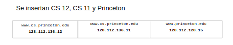

    * 2. Division y se promociona "princeton.edu".

   	 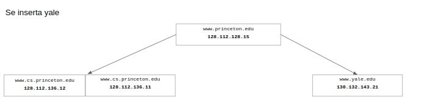

    * 3. Insercion directa de "simpsons.com"" y "apple.com".
    
    	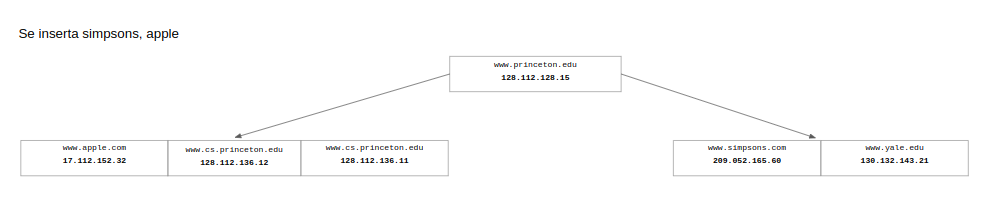
	
    * 4. Se genera una division y se promociona "cs.princeton.edu".
  
    	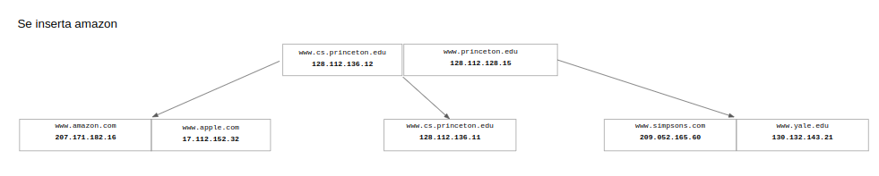

    * 5. Insercion directa.

   	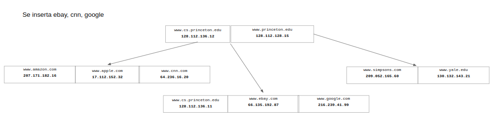

    * 6. Se genera una division y se promociona "google.edu".
    
    	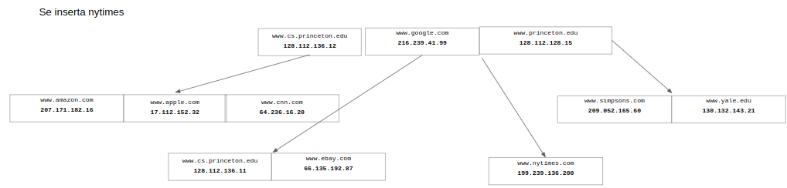

    * 7. Insercion directa.
    
    	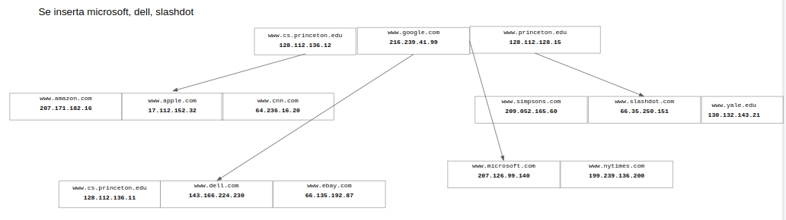    

    * 8. Se promociona "ebay.com".
    
    	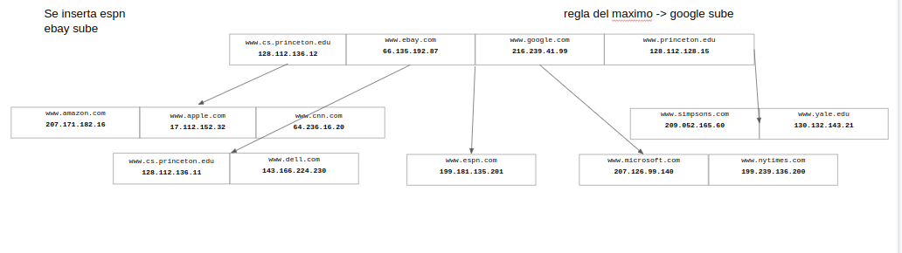
	
    * 9. Division se promociona "google.com".
    
    	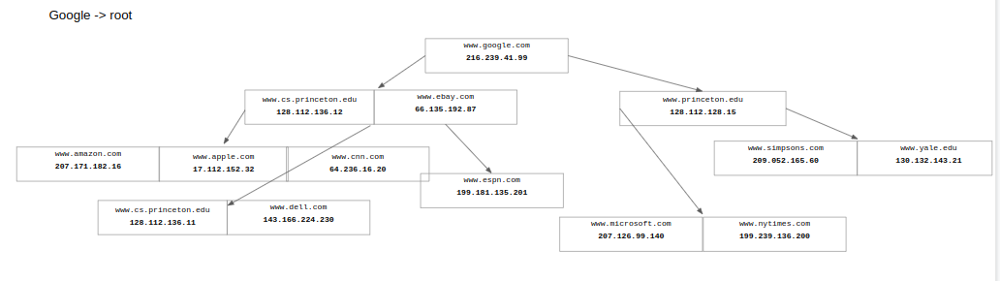
	
    * 10. Insercion directa.
    
    	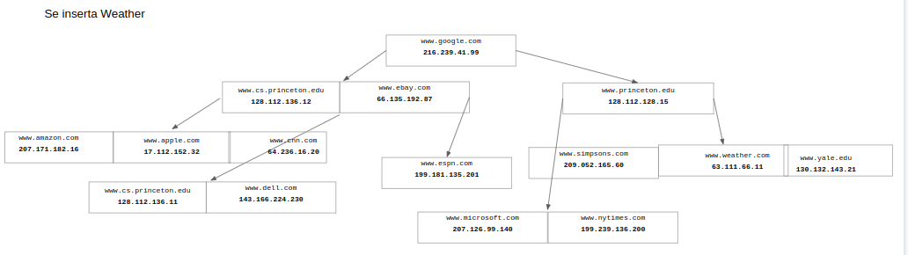
	
    Finalemente nos queda el siguiente diagrama de arbol:
    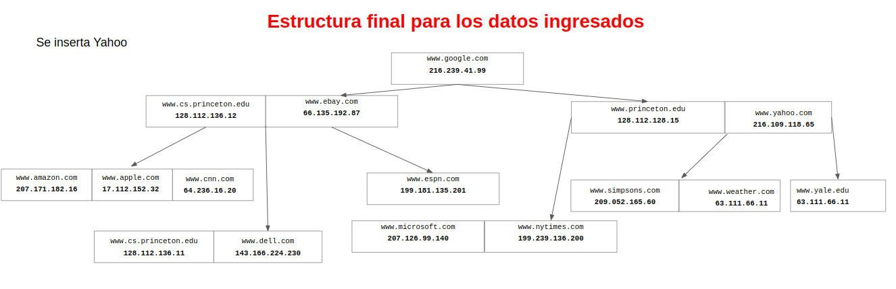

* **Ejercicio 3:** 

    A. El método toString() del árbol, retorna lo siguiente. ¿Por qué están entre paréntesis ciertas claves?

    Cuando se analiza el método <code>toString()</code> se puede notar que cuando se encuentra en una altura que sea mayor a 0 (nodos internos), se produce una iteración y se encuentra la siguiente condición.

    ```java
    if (j > 0)
        s.append(indent + "(" + children[j].key + ")\n");
    ```

    Parte del código responsable de generar esta línea, entonces estas claves que aparecen en paréntesis son claves por donde se desciende en el árbol para imprimir el contenido total que tiene el árbol.

    B. Mostrar paso a paso el arbol-B al eliminar "www.espn.com":

    * 1. Para realizar <code>delete("www.espn.com")</code> al igual que cuando insertamos se tiene que buscar el nodo con la clave que queremos eliminar.
  
    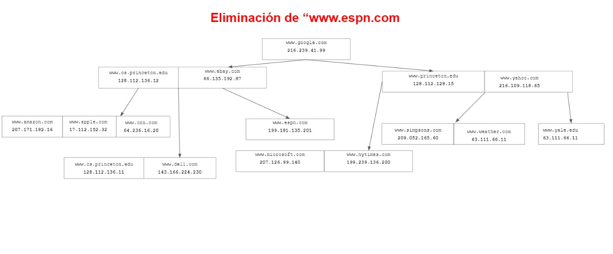

    * 2. Se empieza buscando el nodo a eliminar desde el nodo raíz (<code>root</code>), entonces se evalua el nodo con la clave <code>www.google.com</code> donde se evaluará por donde continuar la búsqueda.

    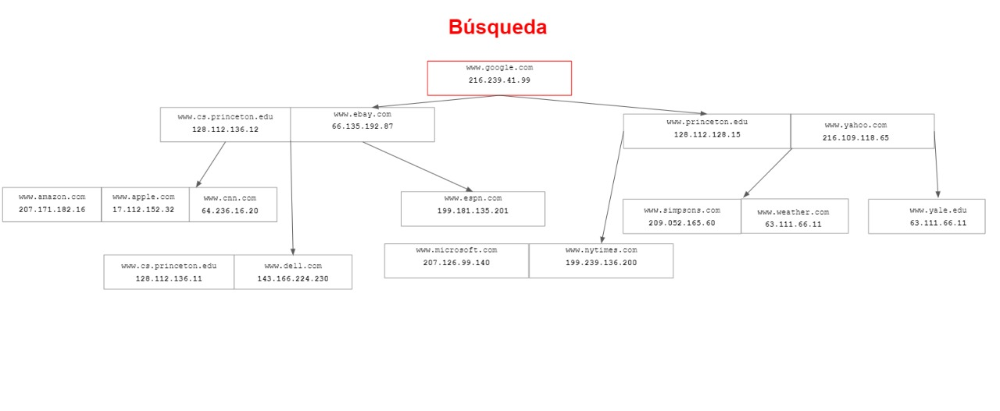

    * 3. Internamente se realiza el <code>"www.espn.com".compareTo("www.google.com")</code> el cual nos dará por resultado un número negativo, indicando que se debe continuar por la izquierda.
    
    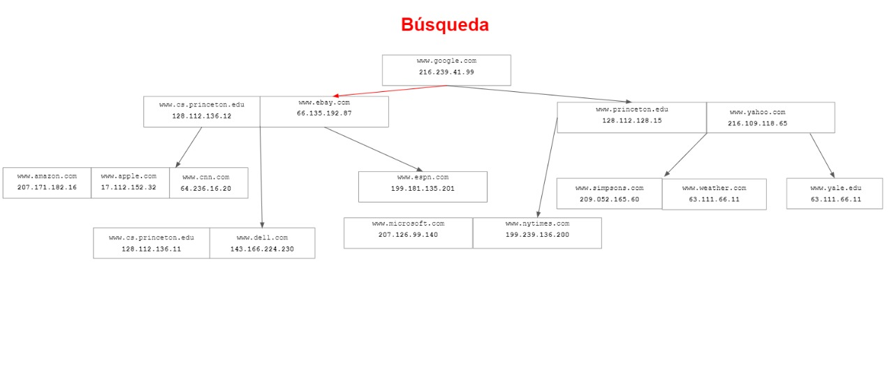

    * 4. Luego tenemos un nodo que tiene 2 <code>Entry</code>, entonces se debe comparar la clave a buscar con las 2 claves que tenemos en este node. Entonces <code>"www.espn.com".compareTo("www.ebay.com")</code> nos resulta en un número positivo.
    
    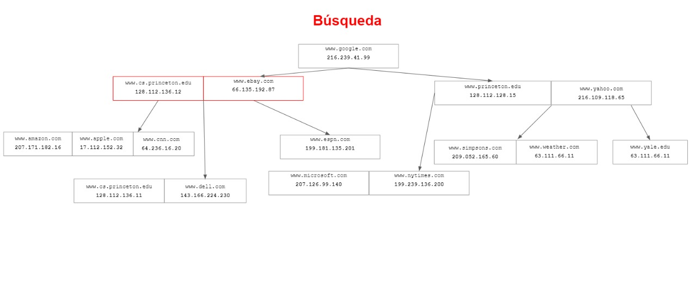

    * 5. Internamente se realiza un <code>"www.espn.com".compareTo("www.ebay.com")</code>, resultado positivo que nos indicaría que debemos seguir por la derecha.
    
    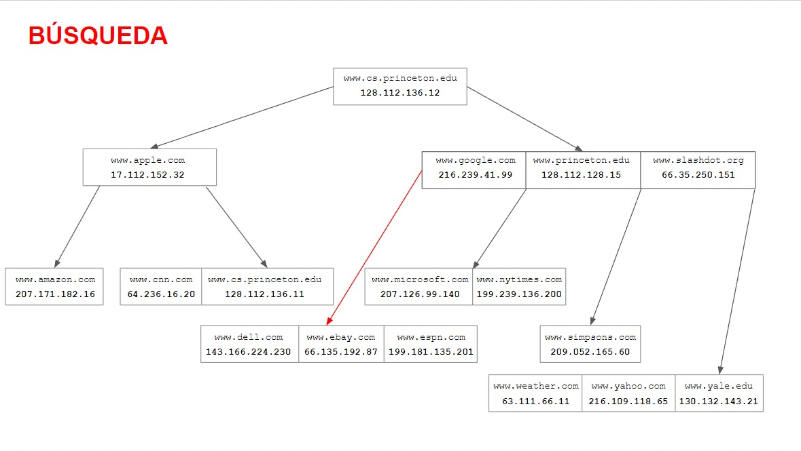

    * 6. A este punto la altura a la que se encuentra es igual a 0, entonces se realizan <code>compareTo()</code> para encontrar la posición de la clave a eliminar
    
    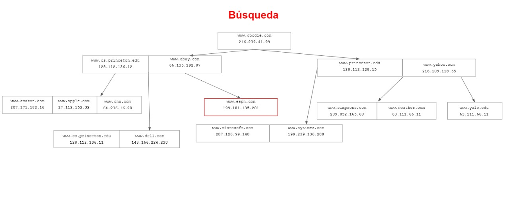

    * 7. Una vez se ha encontrado la posición de la clave se debe analizar si el nodo que queremos eliminar es un nodo interior o es una hoja, en este caso la clave <code>"www.espn.com"</code> es una hoja, por lo que podemos eliminarlo. Luego de eliminar se debe analizar si se realiza una redistribución o una unión dependiendo si el nodo se encuentra en un estado de underflow o se encuentra en overflow.
    
    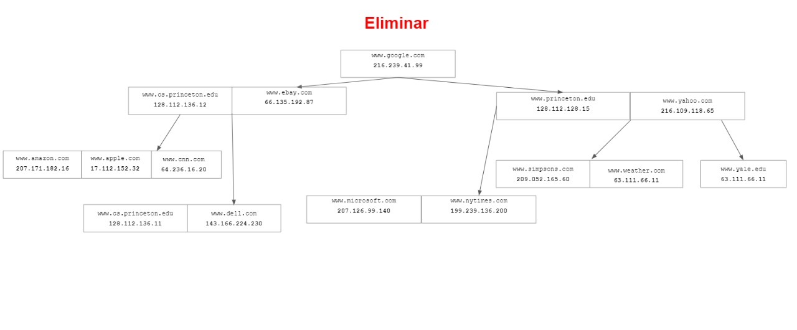

    * 8. En este caso se realiza una unión debido a que el nodo en el que se acaba de eliminar esta en un estado de underflow, resultando de la siguiente forma.
    
    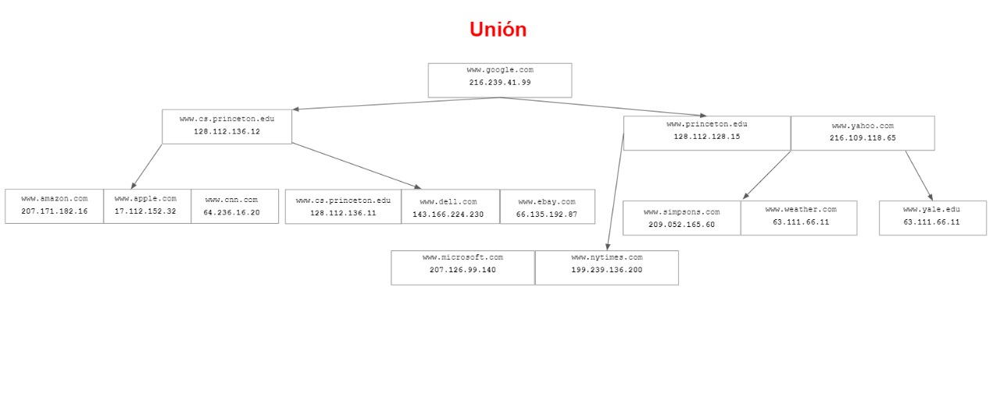
    
* **Ejercicio 4:** Inserción de un nuevo nodo (www.youtube.com)
* 1. Para realizar <code>put("www.youtube.com")</code> empezamos buscando el nodo apropiado para su inserción
  
    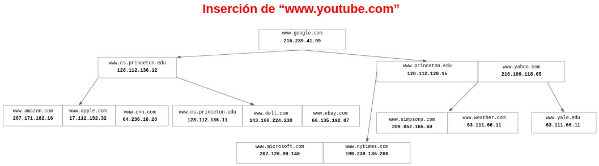

    * 2. Se empieza desde el nodo raíz (<code>root</code>).

    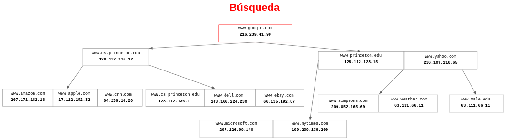

    * 3. Se realizan las comparaciones necesarias entre la clave y la raiz, resultado en tomar la dirección derecha de la raíz
    
    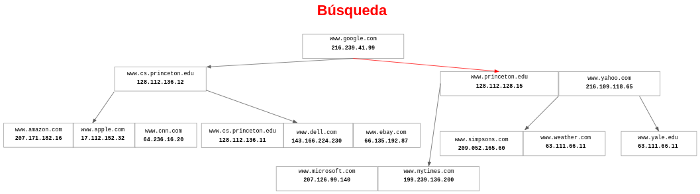

    * 4. Llegados a este nodo, es necesario establecer las comparaciones con la mayoría de ellos, para así establecer una correcta dirección
    
    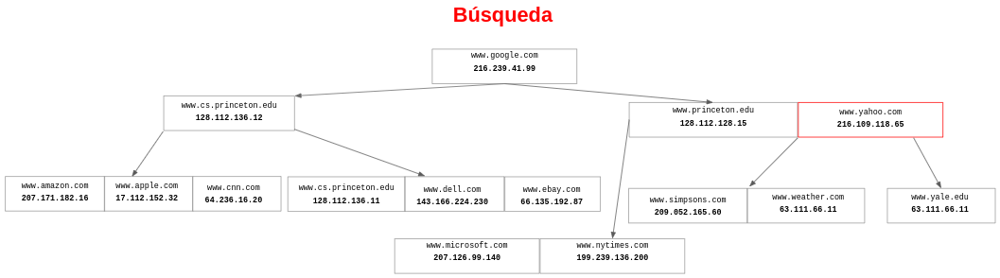

    * 5. Realizadas las comparaciones, es necesario definir la dirección adecuada, esto por medio de la comparación con ("www.yahoo.com"), dirigiendo entonces por su lado derecho
    
    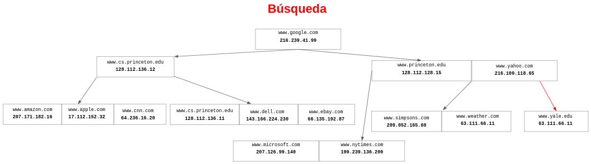

    * 6. A este punto la altura a la que se encuentra es igual a 0, entonces se realizan <code>compareTo()</code> para encontrar la posición adecuada para nuestra clave
    
    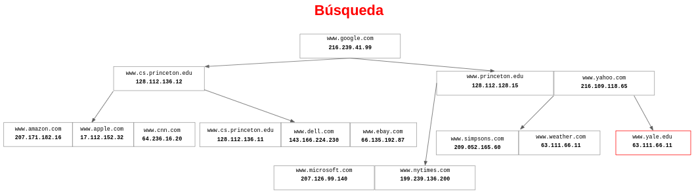

    * 7. El resultado final es:
    
    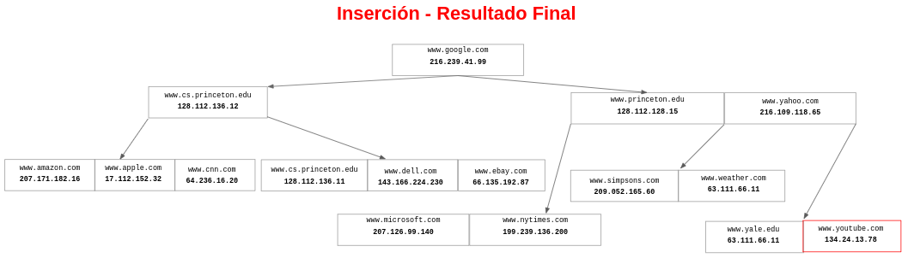
    
II. CONCLUSIONES
	
- Los árboles B tienen ventajas sustanciales sobre otras implementaciones cuando el tiempo de acceso a los nodos excede al tiempo de acceso entre nodos.
- Todos los bloques están llenos en un 75% en promedio, aprobechamiento de espacio
- El desempeño es bueno para tablas pequeñas y grandes y no se degrada cuando la tabla crece.
- Inserciones, modificaciones y eliminaciones son eficientes, y se mantiene el orden de las claves para una recuperación rápida

---
    
## RETROALIMENTACIÓN GENERAL
 <pre>
 
 </pre>
---
    
### REFERENCIAS Y BIBLIOGRAFÍA
<ul>
    <li>https://www.w3schools.com/java/</li>
    <li>https://www.eclipse.org/downloads/packages/release/2022-03/r/eclipse-ide-enterprise-java-and-web-developers</li>
    <li>https://docs.oracle.com/javase/tutorial/java/generics/types.html</li>
</ul>
